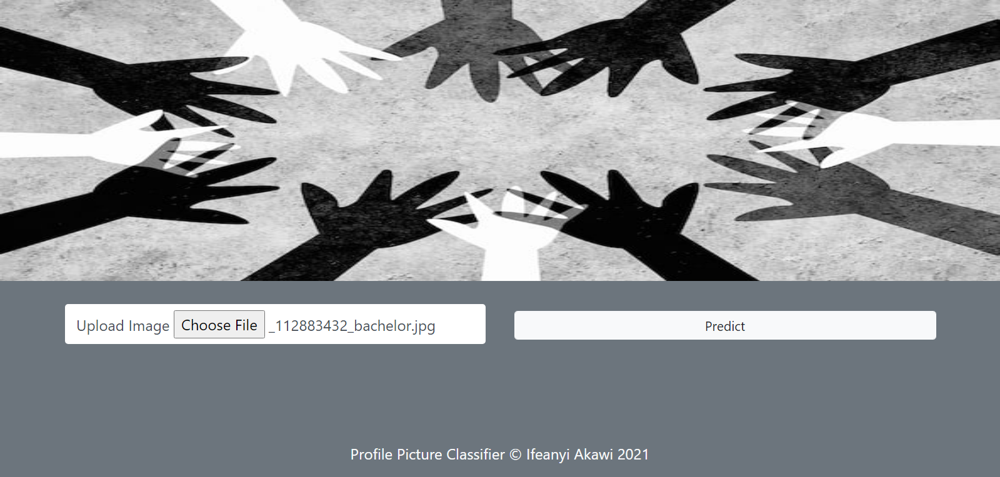
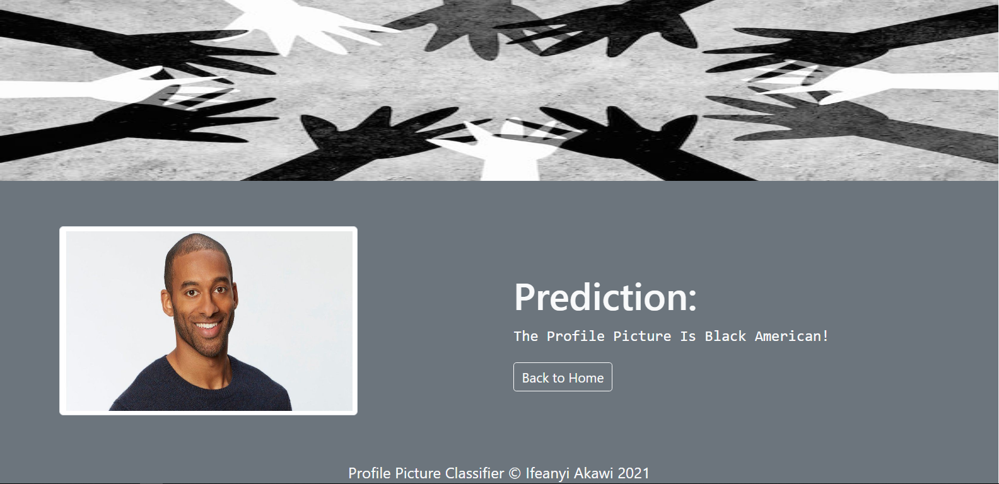

# [Profile Picture Classifier Based on Ethnicity](https://github.com/Akawi85/Profile_Picture_Classifier)
This Web App uses the [EfficientNet_Lite0](https://github.com/tensorflow/tpu/tree/master/models/official/efficientnet/lite) model to build an API that predicts the ethnicity of Profile Pictures.

### Steps
The `scrape_images_of_ethnicity.ipynb` notebook was executed locally to scrape two hundred and twenty (220) images of asian and black americans from google. The scrapper only scrapped for 2 ethnic classes, namely:
- `Asian Americans` and
- `Black Americans`

These classes were selected on the basis of simplicity and can be improved upon. The two selected ethnic classes had 110 images each in a class-separated folder. 100 images from each class was used for training while 10 was used for validation.

Link to the dataset can be found [here](https://www.dropbox.com/sh/oui80zmy1f2xkua/AACDFpJxYi0b9V18vH3DjX49a?dl=0)

### [DataLoader](https://www.tensorflow.org/lite/api_docs/python/tflite_model_maker/image_classifier/DataLoader)
The `classify_profile_picture.ipynb` notebook was executed in google colab for efficeincy and speed. The images from the folders were loaded using the `DataLoader` function from `tflite_model_maker.image_classifier` class. The `DataLoader` function together with the `from_folder` method was used to load images from subdirectories, identifying the subdirectory names as the class labels.

### Model Training
The default [EfficientNet_Lite0](https://github.com/tensorflow/tpu/tree/master/models/official/efficientnet/lite) model from `tflite_model_maker.image_classifier.image_classifier.create` class was used to train the images for 50 epochs achieving an accuracy score of `90.0%` on the validation dataset. A very good score considering the very small volume of data at the model's disposal.  
The `tflite_model_maker` model is stored in the `model_dir` folder as `model.tflite`.  

# Running the service...
- Clone this repo
- Create an isolated python virtual environment and install dependencies in the `requirements.txt` file
- Go to the project directory and run `python3 api.py`
- Click the link to open localhost
- On the homepage of the web app click on `Choose File` to select an image
- Select a toyota image of either an asian or black american from your local machine
- Click on the `Predict` button to the right
- Wait a few seconds for the system to process and predict the ethnicity of the profile picture.
- Viola!!! Here you have your prediction.

# Snapshot of Web App  
#### The home page  
  

#### The prediction Page  
  

# Further Steps  
- [ ] Create a more sophisticated web interface
- [ ] scrape more image dataset to create an even better model
- [ ] Include more ethnic classes